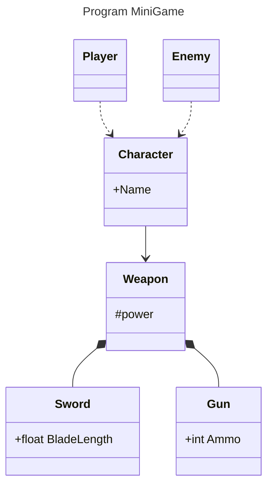

```mermaid
---
title: Program MiniGame
---

classDiagram
    Character--> Weapon
    Character:+Name
    Weapon:#power
    Player..> Character
    Enemy..> Character
    Weapon*-- Sword
    Weapon*-- Gun
    Gun: +int Ammo
    Sword: +float BladeLength
```